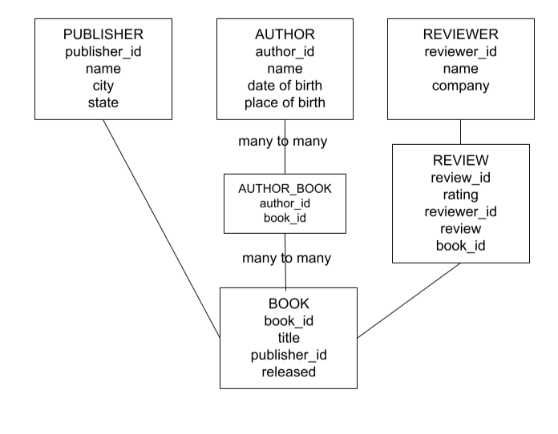

# backend-bookstore

Created a backend bookstore API from scratch. Project and testing created vertically. 

## Created BY

Michelle Nygren
 
GitHub: <a href = "https://github.com/michellerenehey">https://github.com/michellerenehey</a>
 
 
Bailey Kuebelbeck
 
GitHub: <a href = "https://github.com/baileykue">https://github.com/baileykue</a>
 
 
Kevin Do
 
GitHub: <a href = "https://github.com/kevindo1">https://github.com/kevindo1</a>
 
 
Brett Seifried
 
GitHub: <a href = "https://github.com/brettseifried">https://github.com/brettseifried</a>

## Project Routes: 

/api/v1/publishers

/api/v1/reviewers

/api/v1/books

/api/v1/reviews

## Project Goals:
<ul>
    <li>User can get a list of Publishers</li>
    <li>User can get a list of Books</li>
    <li>User can get a list of Authors</li>
    <li>User can get a list of Reviewers</li>
    <li>User can get a list of Reviews (limited to the top 100 highest rated)</li>
    <li>User can get a single Publisher</li>
    <li>User can get a single Book</li>
    <li>User can get a single Author</li>
    <li>User can get a single Reviewer</li>
    <li>User can add a Publisher, Book, Author, Reviewer, and Review</li>
    <li>User can update a Reviewer</li>
    <li>User can delete a Reviewer if they don’t have any reviews</li>
    <li>End-to-end (E2E) tests exist for all the supported routes</li>
    <li>API is deployed to Heroku</li>
</ul>
## ER Model

